# Commands

## Slash Commands

### `/agg`

Get the aggregated challenge mode leaderboards.

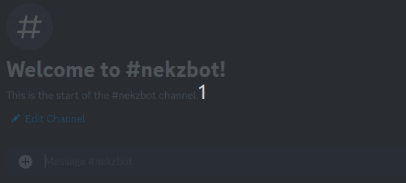

### `/bhop`

Find a bhop level.

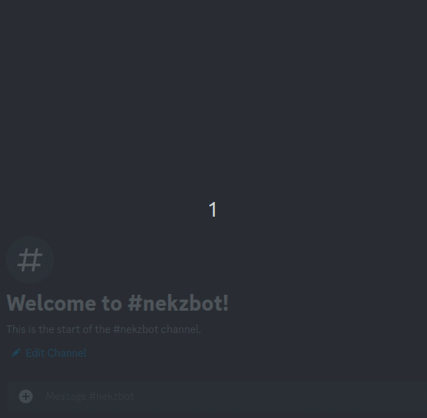

### `/bot info`

Print info about the bot.

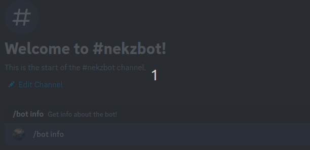

### `/bot reload`

Reload bot data.

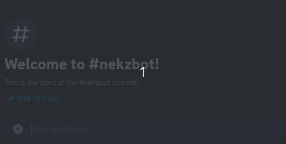

### `/cvars`

Find a console command.

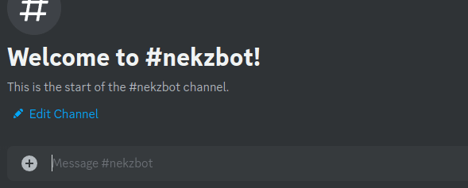

### `/demo info`

Get information about a demo.

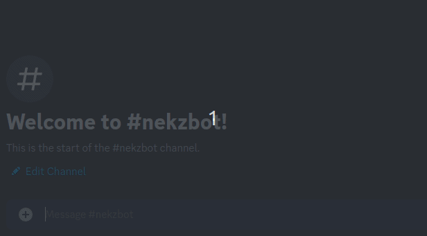

### `/glitch`

Find an entry about a glitch.

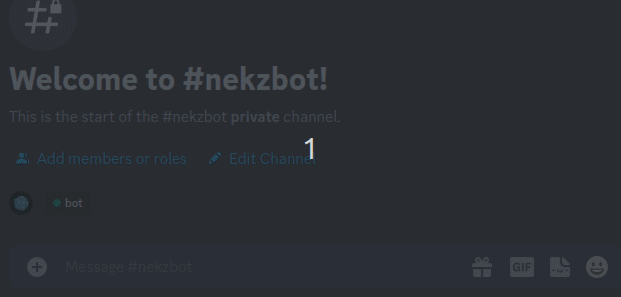

### `/lb`

Get the challenge mode leaderboard.

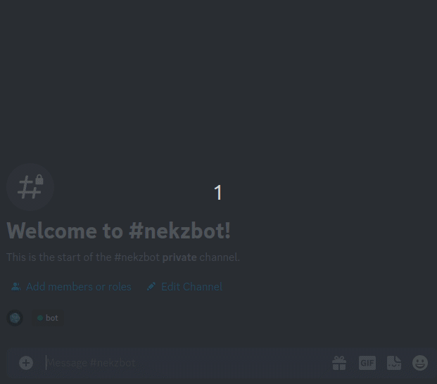

### `/lp`

Find the current least portals record.

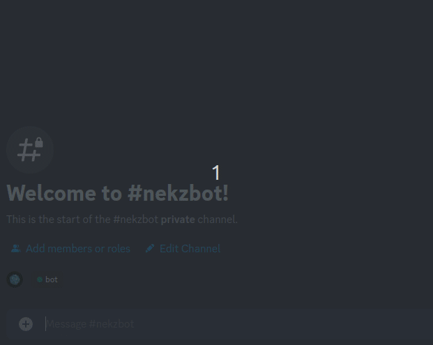

### `/report bug`

Report a bug to a specific project.

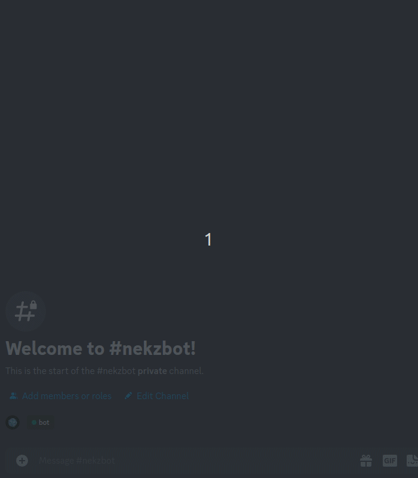

### `/ris`

Convert text to regional indicator symbols.

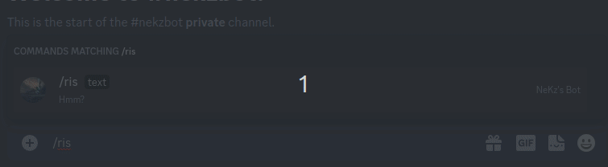

### `/wr`

Get a video of the current challenge mode world record.

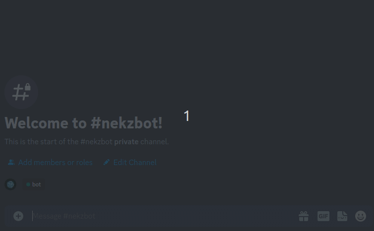

## App Commands

### `Get demo info`

This is the same as the [`/demo info`](#demo-info) command but it works on messages via the context menu.

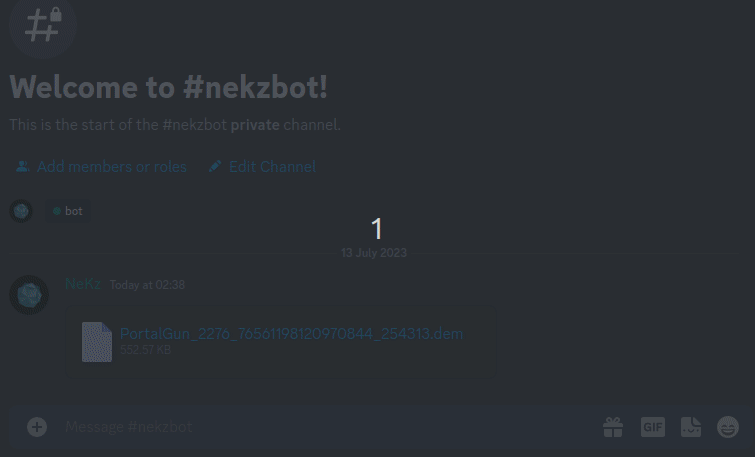

### `Run this as code`

This will run formatted code via the [piston engine].

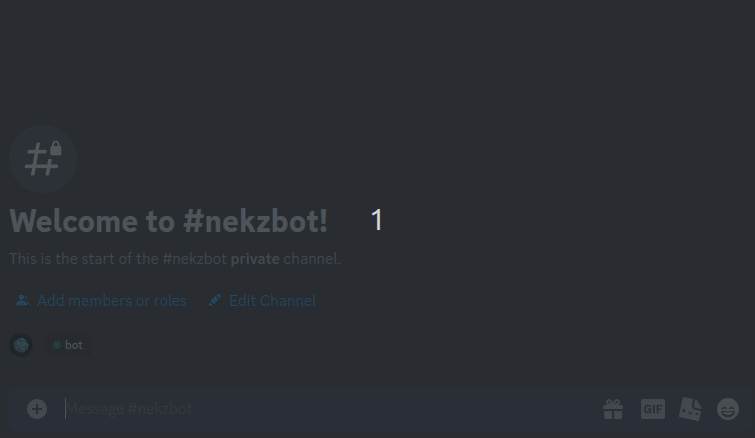

[piston engine]: https://github.com/engineer-man/piston
